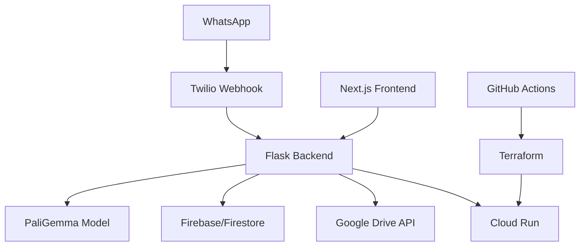

# 🤖 ExpenseBot - AI-Powered Expense Management System

<!-- [](https://github.com/your-username/expense-bot/actions/workflows/ci-cd.yml) -->
[](https://opensource.org/licenses/MIT)


<div align="center">
  
  <p><em>ExpenseBot's Receipt Processing Workflow</em></p>
</div>

A production-ready, AI-powered expense management system that processes receipts through WhatsApp using custom-trained vision models and enterprise-grade infrastructure.

## 🏗️ System Overview

ExpenseBot automates expense tracking by processing receipt images sent via WhatsApp, extracting structured data using custom PaliGemma models, and organizing expenses in Google Drive and Sheets.

### Key Features
- **AI Receipt Processing**: Custom PaliGemma model fine-tuned on 1000+ receipt images
- **WhatsApp Interface**: Conversational expense submission via Twilio
- **Multi-Modal AI**: Handles images, PDFs, and text with confidence scoring
- **Enterprise Infrastructure**: Terraform-managed GCP deployment with auto-scaling
- **Comprehensive Testing**: 80%+ coverage with unit, integration, and E2E tests

## 📁 Project Structure

```
expense-bot/
├── backend/               # Python Flask API with AI services
├── frontend/              # Next.js React application  
├── infra/                 # Infrastructure as Code (Terraform, Docker, CI/CD)
├── notebooks/             # ML model training and analysis
└── .github/workflows/     # CI/CD pipelines
```

## 🚀 Quick Start

### Prerequisites
- Node.js 20+, Python 3.11+, Bun
- Firebase CLI
- Docker (optional)

### Local Development
```bash
# Clone and setup
git clone https://github.com/your-username/expense-bot.git
cd expense-bot

# Complete setup for new developers
./scripts/dev-setup.sh

# Start all services (frontend, backend, Firebase emulators)
make dev

# Or install dependencies and start individually
make install
make emulators  # Terminal 1
make backend    # Terminal 2  
make frontend   # Terminal 3
```

**Service URLs:**
- Frontend: http://localhost:3000
- Backend API: http://localhost:9004
- Firebase UI: http://localhost:4000

### Production Deployment
See [Infrastructure README](infra/README.md) for detailed deployment instructions.

## 🛠️ Technology Stack

| Component | Technology |
|-----------|------------|
| **Backend** | Python Flask, Google Gemini AI, PaliGemma |
| **Frontend** | Next.js 15, React 19, Tailwind CSS |
| **AI/ML** | Custom PaliGemma, Hugging Face, W&B |
| **Database** | Firebase Firestore, Google Drive API |
| **Infrastructure** | GCP, Terraform, Docker, Cloud Run |
| **CI/CD** | GitHub Actions, automated testing |
| **Monitoring** | Prometheus, Grafana, Jaeger |

## 📚 Documentation

- **[Development Guide](DEVELOPMENT.md)** - Complete local development setup
- **[Infrastructure Setup](infra/README.md)** - Complete deployment guide
- **[Backend API](backend/README.md)** - API documentation and development
- **[Frontend Guide](frontend/README.md)** - UI development and components
- **[ML Training](notebooks/README.md)** - Model training and MLOps

## 🧪 Development Commands

```bash
# Essential commands
make dev        # Start all services
make install    # Install dependencies  
make test       # Run all tests
make build      # Build for production
make clean      # Clean artifacts

# Individual services
make frontend   # Start Next.js frontend
make backend    # Start Flask backend
make emulators  # Start Firebase emulators

# Utilities
make help       # Show all commands
make health-check  # Check service status
```

## 🔒 Security & Compliance

- SAST scanning with Bandit and ESLint
- Container vulnerability scanning with Trivy  
- Infrastructure security with Checkov
- Automated dependency updates
- Secret management with Google Secret Manager

## 📊 Architecture



## 🤝 Contributing

1. Fork the repository
2. Create feature branch: `git checkout -b feature/amazing-feature`
3. Run tests: `pytest && npm test`
4. Submit pull request

## 📄 License

MIT License - see [LICENSE](LICENSE) file for details.

---

**Built for Google DeepMind Application** | [Documentation](docs/) | [Issues](https://github.com/your-username/expense-bot/issues)