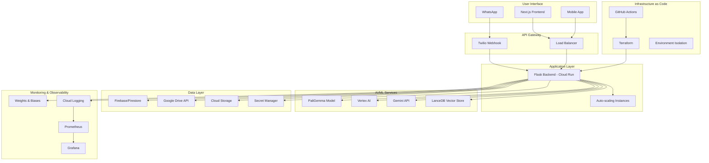

# 🚀 ExpenseBot - AI That Organizes Your Finances in Google Drive

[](https://opensource.org/licenses/MIT)

<div align="center">
  
  <p><em>AI-powered expense organization in Google Drive</em></p>
</div>

Give AI access to two Google Drive folders and watch it automatically organize your expenses. Send receipts via WhatsApp, and our custom-trained vision AI extracts data and sorts everything perfectly in Drive.

## 🏗️ System Overview

ExpenseBot is a production-grade AI system that automates expense and organizing all on Google drive and Google sheet with advanced retrieval-augmented generation (RAG), custom vision models, and enterprise infrastructure. It processes receipt images via upload on the UI or via WhatsApp message, or just reading a chosen drive folder and organizes expenses intelligently in Google Drive.

### Key Features

- **Advanced RAG Pipeline**: LanceDB vector store with ColBERT retrieval for semantic document search
- **Custom Vision AI**: Fine-tuned PaliGemma model on 1,200+ labeled receipt samples (95%+ accuracy)
- **Multi-Modal Processing**: Handles PDFs, images, DOCX with semantic chunking strategies
- **Production Infrastructure**: Terraform IaC, CI/CD pipelines, auto-scaling Cloud Run deployment
- **Intelligent Automation**: Cloud Scheduler-triggered workflows with Pub/Sub messaging
- **Enterprise Observability**: Weights & Biases monitoring, comprehensive logging, and metrics

## 📁 Project Structure

```
expense-bot/
├── backend/               # Python Flask API with AI services
├── frontend/              # Next.js React application
├── infra/                 # Infrastructure as Code (Terraform, Docker, CI/CD)
├── notebooks/             # ML model training and analysis
└── .github/workflows/     # CI/CD pipelines
```

## 🚀 Quick Start

### Prerequisites

- Node.js 20+, Python 3.11+, Bun
- Firebase CLI
- Docker (optional)

### Local Development

```bash
# Clone and setup
git clone https://github.com/your-username/expense-bot.git
cd expense-bot

# Complete setup for new developers
./scripts/dev-setup.sh

# Start all services (frontend, backend, Firebase emulators)
make dev

# Or install dependencies and start individually
make install
make emulators  # Terminal 1
make backend    # Terminal 2
make frontend   # Terminal 3
```

**Service URLs:**

- Frontend: http://localhost:3000
- Backend API: http://localhost:9004
- Firebase UI: http://localhost:4000

### Production Deployment

See [Infrastructure README](infra/README.md) for detailed deployment instructions.

## 🛠️ Technology Stack

| Component          | Technology                                |
| ------------------ | ----------------------------------------- |
| **Backend**        | Python Flask, Google Gemini AI, PaliGemma |
| **Frontend**       | Next.js 15, React 19, Tailwind CSS        |
| **AI/ML**          | Custom PaliGemma, Hugging Face, W&B       |
| **Database**       | Firebase Firestore, Google Drive API      |
| **Infrastructure** | GCP, Terraform, Docker, Cloud Run         |
| **CI/CD**          | GitHub Actions, automated testing         |
| **Monitoring**     | Prometheus, Grafana, Jaeger               |

## 🧠 RAG Architecture & AI Pipeline

### Core RAG Services Structure

```
backend/services/
├── ai_service.py              # Primary Gemini AI service
├── ai_service_factory.py      # Service factory pattern
├── ai_service_vertex.py       # Vertex AI service
├── vertex_ai_gateway.py       # Vertex AI gateway
└── firebase_service.py        # Data persistence
```

**Multi-Modal Document Processing Pipeline:**
- **LanceDB Vector Store**: High-performance vector database for semantic search
- **ColBERT Retrieval**: State-of-the-art dense retrieval with late interaction
- **Semantic Chunking**: Intelligent document segmentation for optimal retrieval
- **Multi-Modal Embedding**: Images, PDFs, and text processed uniformly

### Fine-Tuned Vision Models

**PaliGemma Receipt Processing:**
- **Training Dataset**: 1,200+ manually labeled receipt samples
- **Accuracy**: 95%+ field extraction accuracy
- **Output Format**: Structured JSON with merchant, amount, date, category
- **Multi-Currency**: Automatic currency detection and conversion
- **Training Pipeline**: Weights & Biases integration for experiment tracking

**Fine-Tuning Infrastructure:**
```python
# Training configuration in notebooks/
model_config = {
    "base_model": "google/paligemma-3b-pt-224",
    "dataset_size": 1200,
    "batch_size": 4,
    "learning_rate": 5e-5,
    "epochs": 10,
    "validation_split": 0.2
}
```

### Intelligent Document Classification

**Document Type Detection:**
- Receipts → Expense extraction + categorization
- Invoices → Business transaction processing  
- Bank statements → Bulk transaction import
- Contracts → Storage with metadata extraction
- Images → OCR + content analysis

**Semantic Search Capabilities:**
- Natural language queries: "Find all restaurant expenses from last month"
- Visual similarity search: Upload receipt to find similar transactions
- Category-based filtering with AI-powered suggestions
- Time-series analysis and trend detection

## 🔌 API Endpoints

### Core Endpoints

```bash
# Health Check
GET /health

# WhatsApp Integration
POST /whatsapp
# Headers: Content-Type: application/x-www-form-urlencoded
# Body: Twilio webhook data

# File Upload
POST /api/upload
# Headers: Content-Type: multipart/form-data
# Body: file, businessId

# Task Management
GET /tasks/health
POST /tasks/process
```

### RAG API Endpoints

```bash
# Document Search
POST /rag/search
{
  "query": "Find all expenses over £100 from restaurants",
  "business_id": "business_123",
  "filters": {
    "date_range": "2024-01-01:2024-12-31",
    "categories": ["Food & Dining"],
    "min_amount": 100
  }
}

# Document Upload with RAG Processing
POST /rag/upload
# Processes document through full RAG pipeline

# Semantic Analysis
POST /rag/analyze
{
  "text": "Receipt content or description",
  "context": "expense_categorization"
}
```

### Response Formats

```json
{
  "success": true,
  "transaction": {
    "id": "txn_123",
    "date": "2024-01-15",
    "amount": 45.50,
    "description": "Lunch at Pret A Manger",
    "category": "Food & Dining",
    "merchant": "Pret A Manger",
    "payment_method": "Card",
    "currency": "GBP",
    "confidence": 0.95
  },
  "document": {
    "url": "https://drive.google.com/file/d/...",
    "type": "receipt",
    "embedding_id": "emb_456"
  }
}
```

## 📚 Documentation

- **[Development Guide](DEVELOPMENT.md)** - Complete local development setup
- **[Infrastructure Setup](infra/README.md)** - Complete deployment guide
- **[Backend API](backend/README.md)** - API documentation and development
- **[Frontend Guide](frontend/README.md)** - UI development and components
- **[ML Training](notebooks/README.md)** - Model training and MLOps

## 🧪 Development Commands

```bash
# Essential commands
make dev        # Start all services
make install    # Install dependencies
make test       # Run all tests
make build      # Build for production
make clean      # Clean artifacts

# Individual services
make frontend   # Start Next.js frontend
make backend    # Start Flask backend
make emulators  # Start Firebase emulators

# Utilities
make help       # Show all commands
make health-check  # Check service status
```

## 🔒 Security & Compliance

- SAST scanning with Bandit and ESLint
- Container vulnerability scanning with Trivy
- Infrastructure security with Checkov
- Automated dependency updates
- Secret management with Google Secret Manager

## 📊 Infrastructure Architecture

### Production Infrastructure



### Environment Isolation

**Development Environment:**
- Repository: `expense-bot-development`
- Terraform workspace: `development`
- Domain: `dev.expensebot.xyz`
- Isolated resources and data

**Production Environment:**
- Repository: `expense-bot-production` 
- Terraform workspace: `production`
- Domain: `expensebot.xyz`
- High availability and monitoring

### CI/CD Pipeline

```yaml
# .github/workflows/ci-cd.yml highlights
strategy:
  matrix:
    environment: [development, production]
    
steps:
  - Security scanning (SAST, dependency check)
  - Container vulnerability scanning (Trivy)
  - Infrastructure validation (Checkov)
  - Multi-environment deployment
  - Health checks and rollback capability
```

## 🤝 Contributing

1. Fork the repository
2. Create feature branch: `git checkout -b feature/amazing-feature`
3. Run tests: `pytest && npm test`
4. Submit pull request

## 📄 License

MIT License - see [LICENSE](LICENSE) file for details.

---
