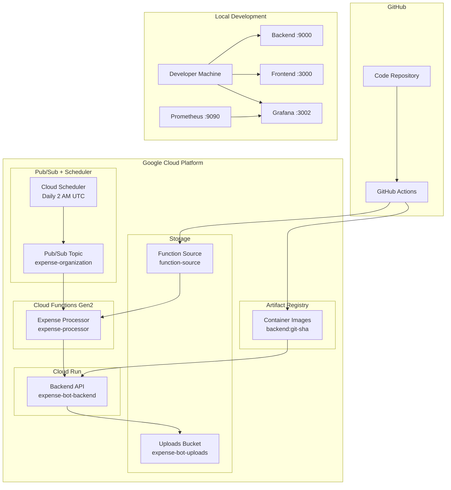
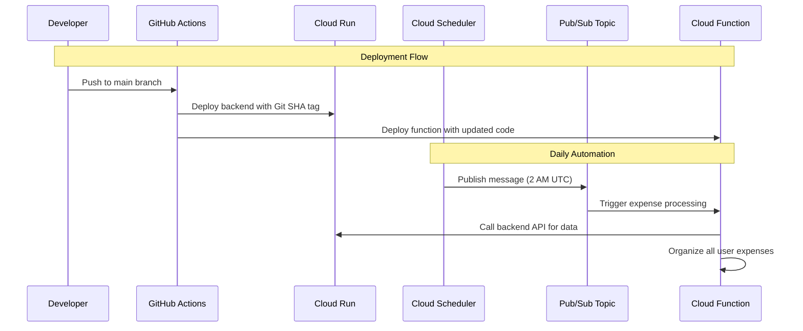
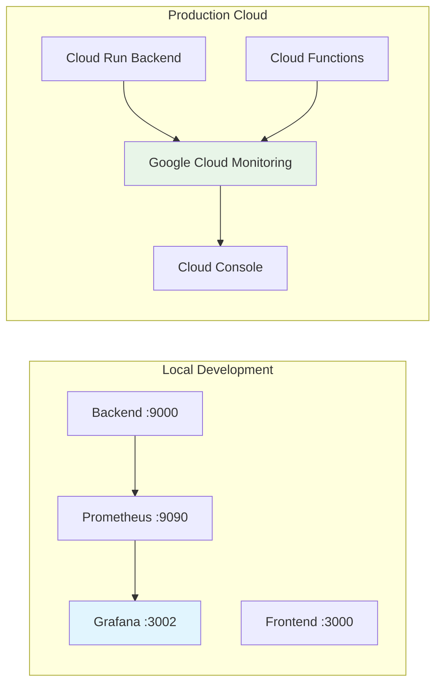

# ExpenseBot Infrastructure

Simple deployment tracking and environment management.

## Quick Deploy

**Development:**
```bash
terraform apply -var-file=environments/development.tfvars
```

**Production:**
```bash
terraform apply -var-file=environments/production.tfvars
```

## What Gets Deployed (Cloud)

- **Backend API** (Cloud Run)
- **Cloud Function** (daily expense organization) 
- **Pub/Sub + Scheduler** (triggers function at 2 AM UTC)
- **Storage buckets** (uploads + function source)

## Local Development

```bash
# Start services separately
make backend      # Native backend (port 9000)
make frontend     # Native frontend (port 3000)
make infra        # Monitoring stack

# Or use Docker
make docker-backend
make docker-frontend
```

**URLs:**
- Backend: http://localhost:9000
- Frontend: http://localhost:3000  
- Grafana: http://localhost:3002 (admin/admin123)
- Prometheus: http://localhost:9090

## Monitoring Strategy

**Local Development:**
- Grafana + Prometheus run locally via Docker
- Use for development debugging and metrics testing
- Data stays on your machine

**Production Monitoring:**
- **Option 1**: Google Cloud Monitoring (recommended)
  - Built-in Cloud Run/Functions metrics
  - No extra infrastructure to manage
  - Access via Google Cloud Console

- **Option 2**: Deploy monitoring to cloud
  - Run Grafana on Cloud Run
  - Use Google Cloud Monitoring as data source
  - For custom dashboards and alerting

**Why local monitoring?**
- Fast development feedback
- Test metrics collection before deploying
- Debug performance issues locally
- No cloud costs during development

**Production URLs:**
- **Development API**: `terraform output backend_url`
- **Production API**: https://expense-bot-backend-production-cvfh2j6d3q-uc.a.run.app
- **Cloud Console**: https://console.cloud.google.com/run?project=expense-bot-441618

## Architecture Overview

### Cloud Infrastructure


### Event Flow


### Local vs Cloud Monitoring


## File Structure & Purpose

```
infra/
├── terraform/
│   ├── main.tf              # Core infrastructure resources
│   ├── variables.tf         # Input parameters
│   ├── outputs.tf          # Resource URLs and info
│   └── environments/
│       ├── development.tfvars    # Dev environment config
│       └── production.tfvars     # Prod environment config
├── docker-compose.yml      # Local development services
├── prometheus/
│   └── prometheus.yml      # Metrics collection config
└── grafana/
    ├── dashboards/         # Custom dashboard definitions
    └── provisioning/       # Auto-setup data sources
```

**Key Infrastructure Files:**
- `main.tf` - Defines Cloud Run, Functions, Pub/Sub, Storage
- `environments/*.tfvars` - Environment-specific settings (CPU, memory, scaling)
- `docker-compose.yml` - Local monitoring stack (Grafana, Prometheus, MinIO)

## Deployment Tracking

- **Docker images tagged with Git SHA**: `backend:$GITHUB_SHA`
- **GitHub Actions auto-deploy**: Push to `main` → production
- **Image labels link to GitHub**: `docker inspect IMAGE | grep Labels`

## 📁 Structure

```
infra/
├── terraform/
│   ├── main.tf
│   ├── variables.tf
│   ├── outputs.tf
│   └── environments/
├── docker/
├── nginx/
├── prometheus/
└── grafana/
```

## 🐳 Docker Services

| Service | URL | Description |
|---------|-----|-------------|
| Frontend | http://localhost:3000 | Next.js app |
| Backend | http://localhost:8080 | Flask API |
| Grafana | http://localhost:3001 | Metrics (admin/admin123) |
| Redis Commander | http://localhost:8082 | Redis UI (--profile admin) |
| MinIO | http://localhost:9001 | S3 storage (admin/admin123456) |

## 🔧 Common Issues

```bash
# Billing not enabled
gcloud beta billing accounts list
gcloud beta billing projects link PROJECT_ID --billing-account=BILLING_ID

# APIs not enabled
gcloud services enable SERVICE_NAME

# Docker image not found (most common)
# Solution: Build and push images first
./scripts/build-and-push-images.sh

# Terraform state bucket
gsutil ls gs://PROJECT_ID-terraform-state

# Cloud Run service deployment failed
# Solution: Use two-phase deployment
# 1. deploy_applications = false (infrastructure only)
# 2. Build images
# 3. deploy_applications = true (deploy apps)
```

## 🔒 Secrets

```bash
# Create secrets
echo -n "value" | gcloud secrets create SECRET_NAME --data-file=-

# GitHub Actions secrets needed:
GCP_PROJECT_ID
GCP_SA_KEY  # base64 encoded service account key
```

## 📝 Environment Variables

Backend `.env`:
```
PROJECT_ID=your-project-id
GOOGLE_AI_API_KEY=your-key
TWILIO_ACCOUNT_SID=your-sid
TWILIO_AUTH_TOKEN=your-token
```

Frontend `.env.local`:
```
NEXT_PUBLIC_API_URL=http://localhost:8080
NEXTAUTH_SECRET=your-secret
```